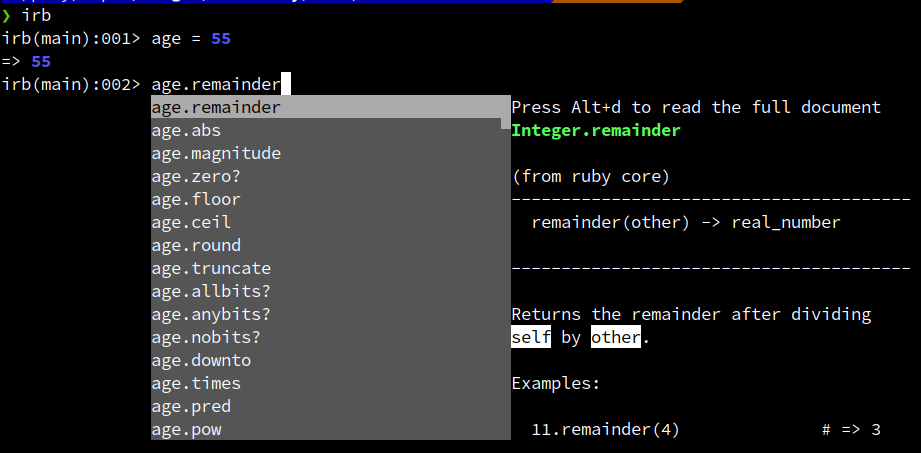

[<< back](./README.md)

# 4. Mi amigo IRB

A ver, pero ¿cómo podemos tener ayuda para programar en Ruby? (Y no me refiero a la IA)... por un lado consultando la documentación de [Ruby Docs](https://ruby-doc.org/), o también "hablando" con IRB.

IRB (Interactive Ruby), es lo que técnicamente llamamos un REPL (Read-Eval-Print Loop o Bucle de Lectura-Evaluación-Impresión). Es el sueño de cualquier programador que odia esperar: escribes una línea, pulsas Enter y ves el resultado al instante, sin intermediarios. Esta idea la "copió" Matz de List.

Otros lenguajes también tienen un REPL: Python(`python`), JavaScript(`node`), Elixir(`iex`), Haskell(`ghci`), Closure, PHP(`php -a`), Java(`jshell`), C#(`csi`), etc.

Iniciamos una sesión IRB con el comando `irb`, terminamos con `exit` o `quit`. Ruby no maximiza la ortogonalidad del lenguaje sino que prefiere la flexibilidad y comodidad del programador.

```console
$ irb  

irb(main):001> nombre = "Obi-Wan Kenobi"
=> "Obi-Wan Kenobi"

irb(main):002> nombre.upcase
=> "OBI-WAN KENOBI"

irb(main):003> nombre.split
=> ["Obi-Wan", "Kenobi"]

irb(main):004> quit
```

Si escribimos la variable y el punto, IRB espera que a continuación se escriba el método, pero pulsando TAB se muestra una ayuda como la siguiente:



## Más ayudantes

* **Ruby LSP**: Los editores IDE pueden incorporar un [Ruby LSP](https://shopify.github.io/ruby-lsp/) para ayudar al autocompletado. Esto es una implementación del protocolo de servidor de lenguaje para Ruby, para mejorar las funciones de ayuda de los editores.
* **Ruby Warninigs**:
     * Vídeo - [RubySur - Marzo 2026](https://youtu.be/IJRtU7XlZwM)

---
[next >>](./05-ruido.md)